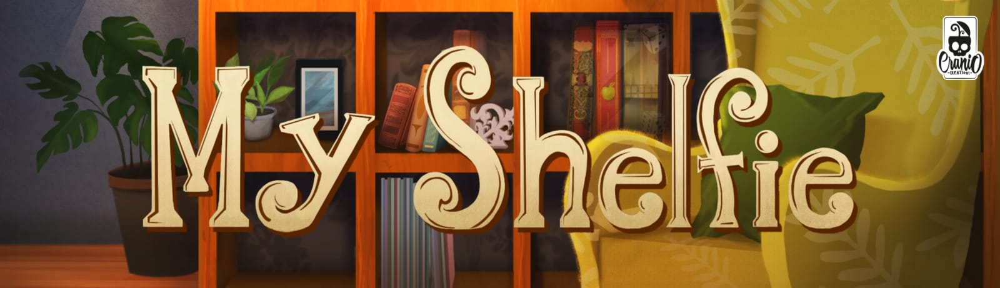

# Prova Finale di Ingegneria del Software - AA 2022-2023

Implementazione del gioco da tavolo [MyShelfie](https://www.craniocreations.it/prodotto/my-shelfie/).

Il progetto consiste nell’implementazione di un sistema distribuito composto da un singolo server in grado di gestire più partite alla volta e multipli client (uno per giocatore) che possono partecipare ad una sola partita alla volta utilizzando il pattern MVC (Model-View-Controller).
La rete è stata gestita con l'utilizzo delle socket.

Interazione e gameplay: linea di comando (CLI) e grafica (GUI).

## Documentazione

### UML
I seguenti diagrammi delle classi rappresentano rispettivamente il modello iniziale sviluppato durante la fase di progettazione e i diagrammi del prodotto finale nelle parti critiche riscontrate.
- [UML Iniziali](https://github.com/AngelaZabriesak/proj-ingsw-Ifrit_Anonimi/blob/main/UML/umlMyShelfie.mdj)
- [UML Finali](https://github.com/AngelaZabriesak/proj-ingsw-Ifrit_Anonimi/blob/main/UML/final/)

## Funzionalità
### Funzionalità Sviluppate
- Regole Complete
- CLI
- GUI
- Socket
- 2 FA (Funzionalità Avanzate):
    - __Partite Multiple: possibilità di eseguire più partite in parallelo.
    - __Chat

##javaDoc
I file javaDoc si possono trovare al seguente link
- [javaDoc](https://github.com/AngelaZabriesak/proj-ingsw-Ifrit_Anonimi/blob/main/javadoc)

## Esecuzione
Questo progetto richiede una versione di Java 19 o superiore per essere eseguito correttamente.

### MyShelfie Client
Le seguenti istruzioni descrivono come eseguire il client con interfaccia CLI o GUI.

#### CLI
Per lanciare MyShelfie Client CLI eseguire la classe ClientAppCLI

#### GUI
Per lanciare MyShelfie Client GUI eseguire la classe ClientAppGUI

### MyShelfie Server
Per lanciare MyShelfie Server eseguire la classe ServerApp

## Componenti del gruppo
- [__Mattia Asinari__](https://github.com/mattiaasinari)
- [__Elena Tortorella__](https://github.com/elenatortorella7)
- [__Angela Zabriesak__](https://github.com/AngelaZabriesak)
